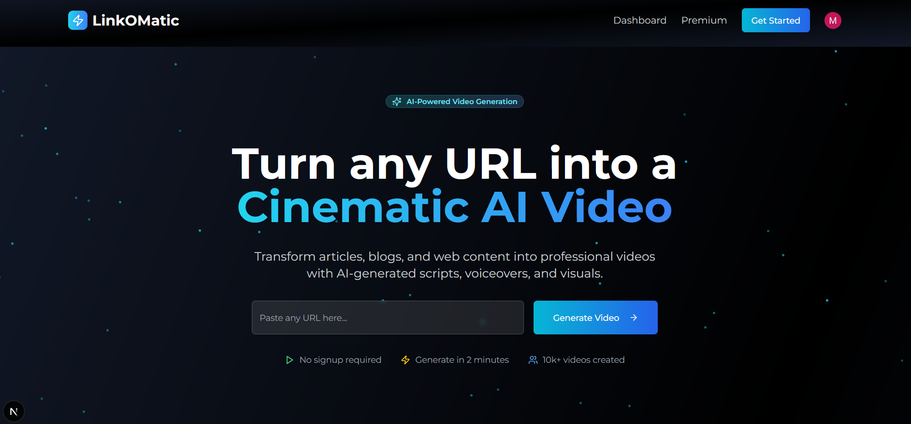
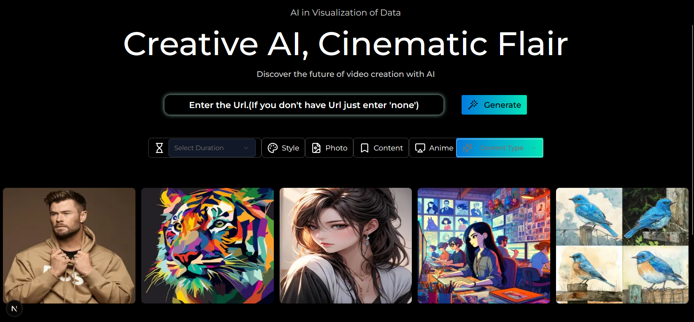

# 🔗 URL to Video Generator

Transform any webpage into an engaging, AI-generated video with just a few inputs.

[](https://nextjs.org/)
[]()
[](https://huggingface.co/)
[](https://www.remotion.dev/)

---

## 🏆 Achievements

✨ Finalist in 3 National Hackathons:
- Microsoft Office, Gurugram 🇮🇳
- Adgips
- JIMS

---

## 🎥 What It Does

This platform converts any **URL** into a **fully automated video** using modern AI and web technologies.

### 🧠 How it works:
1. **Input**:
   - URL (any website/blog/article)
   - Video Duration
   - Content Type (e.g., YouTuber, Student, Teacher, etc.)
   - Video Style (Realistic, Cartoon, WPAP, Animated, Watercolor)

2. **Processing**:
   - 📄 Web scraping: Extracts meaningful data from the URL
   - 🧾 Script generation: Uses **Hugging Face models** to summarize and generate a script
   - 🗣️ Audio generation: Converts script to realistic voice
   - 🎬 Frame generation: Visual scenes are generated from text
   - 📝 Caption generation: Uses audio-to-text models
   - 🧩 Final video: All assets are stitched using **Remotion**

3. **Output**:
   - A polished, AI-generated video based on the original URL content 🎉

---

## 🚀 Tech Stack

- **Frontend**: Next.js + Tailwind CSS
- **Video Rendering**: [Remotion](https://www.remotion.dev/)
- **AI/ML**: Hugging Face Transformers
- **Web Scraping**: Cheerio / Puppeteer (or your scraping method)
- **State Management**: Zustand
- **Deployment**: Vercel

---

## 📸 Screenshots




---

## 📦 Run Locally

```bash
git clone https://github.com/Mohammad-Ehshan/Link-O-Matic
cd url-to-video
npm install
npm run dev
